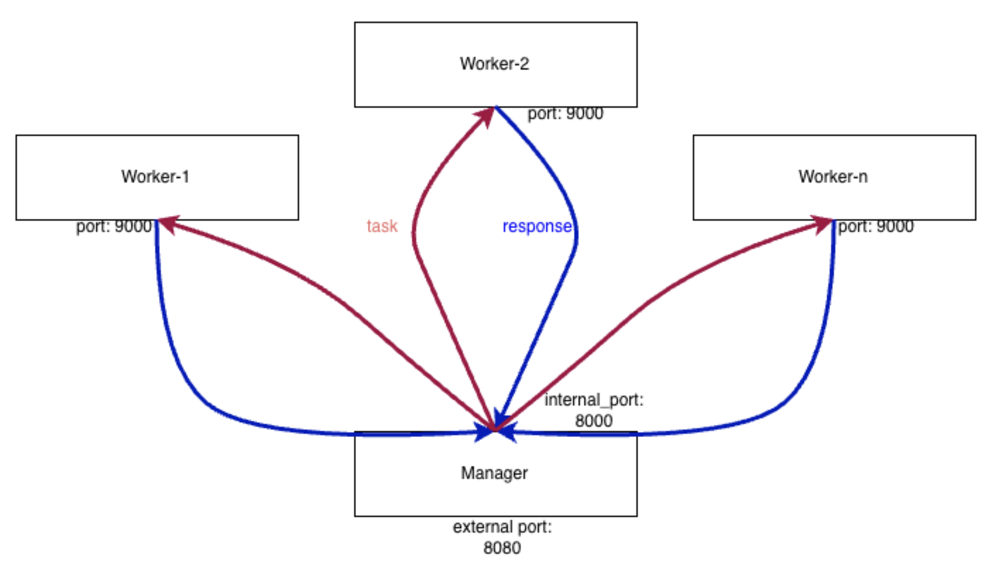

# Hash Cracker - Распределённая система для взлома MD5 хешей

Распределённая система взлома MD5 хешей методом перебора через Lord Key с использованием Docker. Система автоматически распределяет работу между несколькими воркерами, отслеживает прогресс и восстанавливается при сбоях.

## Архитектура системы


### Компоненты

**Manager (manager/app.py)**
- Принимает запросы на взлом хешей
- Распределяет диапазоны для перебора между воркерами
- Отслеживает статус каждого воркера
- Автоматически перераспределяет задачи при отказе воркера
- Агрегирует результаты и предоставляет API для получения статуса задач

**Workers (worker/app.py)**
- Выполняют перебор значений
- Генерируют комбинации из алфавита через LordKey
- Сравнивают MD5 хеши сгенерированных значений с целевым
- Периодически отправляют прогресс менеджеру


## Запуск системы

### Требования
- Docker
- Docker Compose
- Python 3.8+ (для локальной разработки)

### Быстрый старт с Docker Compose

```bash
# 1. Перейти в директорию проекта
cd /path/to/docker_course

# 2. Создать необходимые конфигурационные файлы
# (если их ещё нет)

# 3. Запустить все сервисы
docker-compose up -d

# 4. Проверить статус контейнеров
docker-compose ps

# 5. Просмотреть логи
docker-compose logs -f manager  # логи менеджера
docker-compose logs -f worker   # логи воркеров
```


## API

### API для клиентов

#### 1. Создать задачу на взлом

**Endpoint:** `POST /api/hash/crack`

**Описание:** Создаёт новую задачу на взлом MD5 хеша. 

**Request Body:**
```json
{
  "word": "5f4dcc3b5aa765d61d8327deb882cf99",
  "length": 3
}
```

**Параметры:**
- `word` (string, обязательный): MD5 хеш для взлома (32 символа hex)
- `length` (integer, обязательный): Максимальная длина исходного слова (1-10)

**Response (200 OK):**
```json
{
  "task_id": "550e8400-e29b-41d4-a716-446655440000"
}
```

**Примеры запросов:**

cURL:
```bash
curl -X POST http://localhost:8000/api/hash/crack \
  -H "Content-Type: application/json" \
  -d '{
    "word": "5d41402abc4b2a76b9719d911017c592",
    "length": 5
  }'
```

---

#### 2. Получить статус задачи

**Endpoint:** `GET /api/hash/status?requestId={task_id}`

**Описание:** Возвращает текущий статус выполнения задачи, включая прогресс и найденные слова.

**Параметры запроса:**
- `requestId` (string, обязательный): UUID задачи из ответа POST запроса

**Response (200 OK) - Выполняется:**
```json
{
  "status": "IN_PROGRESS",
  "progress": 45.67,
  "data": ["abc"]
}
```

**Response (200 OK) - Завершено:**
```json
{
  "status": "COMPLETED",
  "progress": 100,
  "data": ["abc", "def", "123"]
}
```

**Response (200 OK) - Ошибка:**
```json
{
  "status": "ERROR",
  "progress": 75.5,
  "data": ["abc"]
}
```

**Примеры запросов:**

cURL:
```bash
curl -X GET "http://localhost:8000/api/hash/status?requestId=550e8400-e29b-41d4-a716-446655440000"
```
---

## Конфигурационные параметры

Параметры настраиваются через переменные окружения в файле `.env` или при запуске контейнеров.

### Параметры менеджера (Manager)

| Параметр | Тип | По умолчанию | Описание |
|----------|-----|--------------|---------|
| `WORKERS` | int | 3 | Количество воркеров в системе |
| `WORKER_PORT` | int | 9000 | Порт, на котором слушают воркеры |
| `TIMEOUT_WORKER_TIME` | int | 2 | Таймаут (в сек) для отслеживания ответа воркера |
| `WAITING_TIME` | int | 1 | Интервал (в сек) проверки статуса воркеров |

### Параметры воркера (Worker)

| Параметр | Тип | По умолчанию | Описание |
|----------|-----|--------------|---------|
| `MANAGER_URL` | string | http://manager:8000 | URL менеджера для отправки обновлений статуса |
| `WAITING_TIME` | int | 1 | Интервал (в сек) отправки прогресса менеджеру |

### Файл конфигурации (config.json)

Оба компонента используют `config.json` для алфавита:

```json
{
  "alphabet": "abcdefghijklmnopqrstuvwxyz0123456789"
}
```

Алфавит используется для генерации комбинаций при переборе. Можно использовать:
- Только буквы: `abcdefghijklmnopqrstuvwxyz`
- Буквы + цифры: `abcdefghijklmnopqrstuvwxyz0123456789`

### Пример .env файла

```env
# Manager settings
WORKERS=3
WORKER_PORT=9000
TIMEOUT_WORKER_TIME=2
WAITING_TIME=1

# Worker settings
MANAGER_URL=http://manager:8000
```